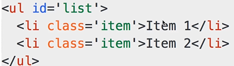
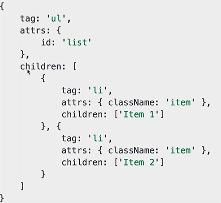
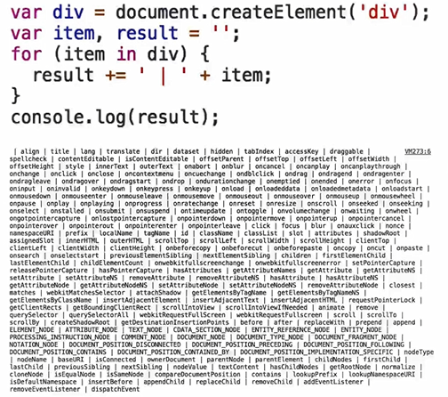

# context 与 contextType

## context 上下文

context 提供一种方式，能够让属性在后代组件树中直接获取，而不是一层一层的传递。

context 会在属性值变化时重新渲染 Consumer 下面的元素

多个Provider可以嵌套起来使用

不过这种方式可能使组件失去独立性，复用更困难。

### API

- createContext(defaultValue)
  - 创建 context 对象的唯一方式,
  - defaultValue是在找不到provider提供值时使用，做业务不会用。写单测可能用
- `<SOMEContext.Provider>`
  - 提供属性
- `<SOMEContext.Consumer>`
  - 消费属性
  - Consumer 可以使用多次
  - Consumer 不能并列用，要嵌套用
  - 函数组件也可以传递


## contextType
 挂载在 class 上的 contextType 属性会被重赋值为一个由 React.createContext() 创建的 Context 对象。这能让你使用 this.context 来消费 Context 上的那个值。你可以在任何生命周期中访问到它，包括 render 函数中。
```JSX
class Another extends Component {
  static contextType = SOMEContext;
  render() {
    let battery = this.context;
    return <h3>{battery}</h3>;
  }
}
```

## demo 

```jsx
import React, { Component, createContext } from 'react';


// Battery 电池
const BatteryContext = createContext();
const OnlineContext = createContext();

function Extra() {
  return (
    <OnlineContext.Consumer>
      {online => (
        <div>
          测试已经 consumer 过的属性是否还能继续使用 Online: {String(online)}
        </div>
      )}
    </OnlineContext.Consumer>
  );
}

class Another extends Component {
  static contextType = BatteryContext;
  render() {
    let battery = this.context;
    return <h3>{battery}</h3>;
  }
}

function Leaf() {
  return (
    <BatteryContext.Consumer>
      {battery => (
        <div>
          <OnlineContext.Consumer>
            {online => (
              <div>
                <h1>
                  Battery: {battery}, Online: {String(online)}
                </h1>
                <Extra />
                <Another />
              </div>
            )}
          </OnlineContext.Consumer>
          
        </div>
      )}
    </BatteryContext.Consumer>
  );
}

function Middle() {
  return <Leaf />;
}

class App extends Component {
  state = { battery: 60, online: false };
  render() {
    const { battery, online } = this.state;
    return (
      <BatteryContext.Provider value={battery}>
        <OnlineContext.Provider value={online}>
          <button
            type="button"
            onClick={() => this.setState({ battery: battery - 1 })}
          >
            Press
          </button>

          <button
            type="button"
            onClick={() => this.setState({ online: !online })}
          >
            Switch
          </button>
          <Middle />
        </OnlineContext.Provider>
      </BatteryContext.Provider>
    );
  }
}

export default App;
```
# [何时使用Component还是PureComponent？](https://segmentfault.com/a/1190000014979065)

参考链接：https://segmentfault.com/a/1190000014979065

PureComponent通过prop和state的浅比较来实现shouldComponentUpdate，某些情况下可以用PureComponent提升性能

所谓浅比较(shallowEqual)，即react源码中的一个函数，然后根据下面的方法进行是不是PureComponent的判断，帮我们做了本来应该我们在shouldComponentUpdate中做的事情

```js
if (this._compositeType === CompositeTypes.PureClass) {
    shouldUpdate = !shallowEqual(prevProps, nextProps) || ! shallowEqual(inst.state, nextState);
}
```

```js
shouldComponentUpdate(nextProps, nextState) {
    return (nextState.person !== this.state.person);
}
```

### 什么时候不该用？
PureComponent中的判断逻辑是浅比较，如果当状态更新时是一个引用对象内部的更新，那么这个时候是不适用的

 - VDOM 是什么？为什么会存在VDOM？
 - VDOM如何应用，核心API是什么
 - 介绍diff算法


### VDOM是什么？为什么会存在VDOM？
在MVVM开发方式中，页面的变化都是用数据去驱动的，而数据更新后，到底要去改那一块的DOM哪？ 
虽然可以先删除那个部分再按照当前新的数据去重新生成一个新的页面或生成那一个部分（jQuery做法），但是这样肯定非常耗费性能的。
而且JS操作DOM是非常复杂，JS操作DOM越多，控制与页面的耦合度就越高，代码越难以维护。

虚拟DOM，即用JS对象来描述DOM树结构，Diff算法则是找旧VDOM与新的VDOM的最小差异，然后再把差异渲染出来




描述一个DOM节点
 - tag 标签名
 - attrs DOM属性键值对
 - childen DOM字节点数组 或 文本内容

[如何理解虚拟 DOM?-zhihu](https://www.zhihu.com/question/29504639?sort=created)


### 为什么DOM操作慢？ 因为属性太多了



### vdom如何应用，核心API是什么
 - 创建虚拟节点
   - h('标签名', {...属性...}, [...子元素...])
   - h('标签名', {...属性...}, '文本内容')
 - 将VNode添加到一个DOM元素内
   - patch(DOM_obj, vnode);
 - 用一个新的vnode来和旧的vnode进行比较，得出新旧dom的差异
 - patch(vnode, newVnode)


###  diff算法
对比Vdom树差异的算法
[React 的 diff 算法](https://segmentfault.com/a/1190000000606216)

#### 同层比对
新旧状态的比对时采用同层比对，当发现某节点不一致了直接替换该节点的子树。而不管它的子树是不是真的改动了。

#### key值的使用
在列表循环的时候React会要求每一个列表项有一个**独一无二**，**稳定的key值**，它的目的是为了当状态改变时新旧状态的每一个列表项能够对应起来，方便比对。

Keys 是 React 用于追踪哪些列表中元素被修改、被添加或者被移除的辅助标识。
 Diff 算法中 React 会借助元素的 Key 值来判断该元素是新近创建的还是被移动而来的元素，从而减少不必要的元素重渲染。此外，React 还需要借助 Key 值来判断元素与本地状态的关联关系

#### 合并操作
调用 component 的 setState 方法的时候, React 将其标记为 dirty.到每一个事件循环结束, React 检查所有标记 dirty 的 component 重新绘制

# hooks

### 类组件的缺点
 - 难以复用的状态逻辑
 - 复杂的生命周期函数
 - 混乱的副作用

# Lazy与Suspense

## lazy
React.lazy 接受一个函数，这个函数需要动态调用 import()。它必须返回一个 Promise，该 Promise 需要 resolve 一个 defalut export 的 React 组件。
```js
const OtherComponent = React.lazy(() => import('./OtherComponent'));
```

lazy函数用来将组件模块的导入行为封装为React组件。封装的是组件导入行为，而不是组件本身。而且导入意味着网络请求。

## Suspense
lazy必须配合Suspense来一起使用，因为在异步加载的过程中，这个空白档必须要给React提供一个loading的组件
注意：
 - Suspense的fallback属性必须传入一个React实例，即一个JSX

## ErrorBoundary
当React的异步组件加载出错时，页面就会报错。它利用了`componentDidCatch`这个生命周期函数来。


## 例子
```jsx
const About = lazy(
  () =>
    new Promise((resolve, reject) => {
      setTimeout(() => {
        resolve(import(/* webpackChunkName:"about" */'./About.jsx'));
      }, 2000);
    })
);

class App extends Component {
  render() {
    return (
      <div>
        <Suspense fallback={<div>Loading...</div>}>
          <About />
        </Suspense>
      </div>
    )
  }
}
```

# memo

在类组件中，我们使用`shouldComponentUpdate`来比避免不需要的渲染
```JSX
// 使用 shouldComponentUpdate
class Foo {
  shouldComponentUpdate(nextProps,nextState) {
    if(nextProps.SOME_VALUE === this.props.SOME_VALUE){
      return false
    }
    return true;
  }
  render () {
    return <div>{props.SOME_VALUE}</div>
  }
}
// 或者直接继承 PureComponent
class Foo extends PureComponent {
  render () {
    return <div>{props.SOME_VALUE}</div>
  }
}
```

## 函数组件使用memo

函数组件未来避免比必要更新
```jsx
const Foo = memo(function (props) {
  return <div>{props.SOME_VALUE}</div>
})
```

### 什么是高阶组件，它有哪些运用？
高阶组件就是一个函数，接收一个组件，经过处理后返回后的新的组件；
高阶组件，不是真正意义上的组件，其实是一种模式；
可以对逻辑代码进行抽离，或者添加某个共用方法；
eg：
 - react-redux ：connect就是一个高阶组件,接收一个component,并返回一个新的componet,处理了监听store和后续的处理；
 - react-router ：withrouter 为一个组件注入 history对象；


### 高阶组件和父组件的区别？
高阶组件可以重写传入组件的state,function,props;可以对代码逻辑进行抽离，重写；
父组件只是控制子组件的view层；


### redux connect 函数

TODO